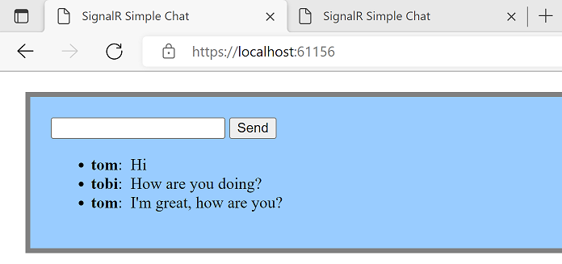
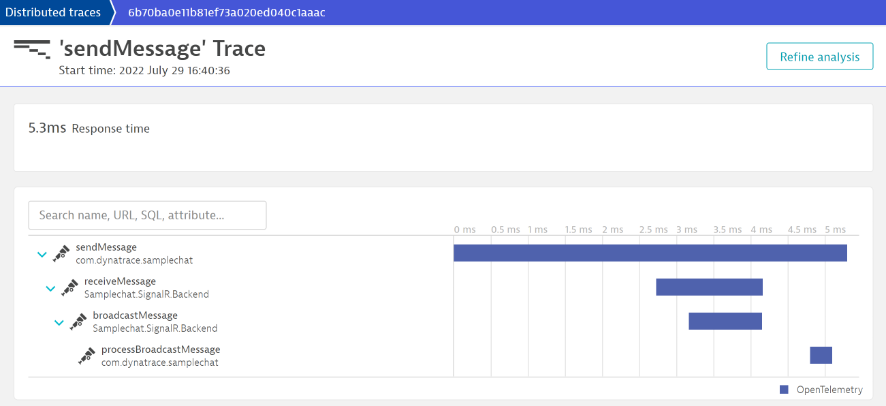

# Sample app for monitoring a SignalR based web-app with Dynatrace & OpenTelemetry

based on https://github.com/aspnet/SignalR-samples/tree/main/ChatSample at commit 4e1e9474a4de92803d60c0b56195ad2568248193

## Pre-Requisites:
- [.NET SDK](https://dotnet.microsoft.com/en-us/download/visual-studio-sdks) - tested with .NET 6.0 for Windows x64
- [node.js and npm](https://nodejs.org/en/download/) - tested with LTS 16.16.0

## Setup:
1. Clone this repo
1. Create a Dynatrace Authentication Token with `openTelemetryTrace.ingest` scope (see [Dynatrace Documentation](https://www.dynatrace.com/support/help/shortlink/opentelemetry-instrumentation-guide#create-token))
1. Prepate the OTel collector by creating and filling out an `.env` file in [`otel-collector`](otel-collector) based on the provided [`.env.template`](otel-collector/.env.template) (use the token created in the previous step)
1. Start the OTel collector by running `docker-compose --env-file .env up` in the [`otel-collector`](otel-collector) folder
1. Build the website part by running `npm ci && npm run build` from [`ChatSample/websrc`](ChatSample/websrc)
1. Open [`ChatSample.sln`](ChatSample.sln) in [VisualStudio](https://visualstudio.microsoft.com/vs/)
1. Run `ChatSample` from the opened VisualStudio project

A browser window will then open where you can enter messages. If you open multiple windows with the same URL, chat messages will be shared between them.
All interactions are monitored using OpenTelemetry, and the resulting spans are visible in Dynatrace under **Applications & Microservices > Distributed Traces > Ingested Traces**

