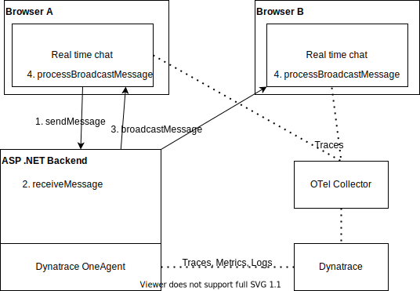
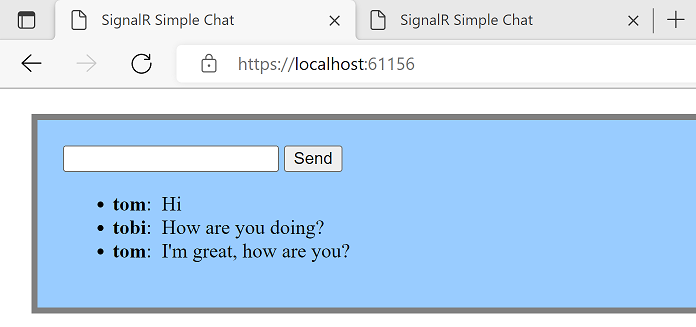
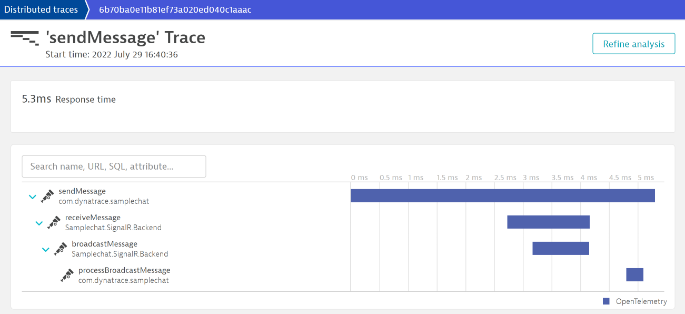

# Sample app for monitoring a SignalR based web-app with Dynatrace & OpenTelemetry

## Who is this for?

- Are you (or do you plan to be) using [Dynatrace](https://www.dynatrace.com/)?
- Are you using .NET and/or JavaScript?
- Do you want to get Tracing insights for a protocol that is not visible out-of-the-box, such as [SignalR](https://docs.microsoft.com/en-us/aspnet/signalr/overview/getting-started/introduction-to-signalr)?

If you answered "yes" to all of those, then have a look at this sample application.

## Overview

This sample application is a real-time chat based on https://github.com/aspnet/SignalR-samples/tree/main/ChatSample at commit 4e1e9474a4de92803d60c0b56195ad2568248193.
Multiple participants can open the webpage, and send messages to each other as a broadcast - i.e. everyone can see every sent message from the moment they join.

For monitoring it uses [OpenTelemetry](https://opentelemetry.io/docs/) - OTel for short - to manually trace through our arbitrary protocol - in this case SignalR. Traces are shared between .NET and JavaScript, but the same would also work JS -> JS or .NET -> .NET.

The way this works is via manual Context Propagation - which as of this writing (02. August 2022) is not yet part of the OTel documentation.

Traces are sent to Dynatrace via a [Collector](https://opentelemetry.io/docs/concepts/components/#collector).

## Pre-Requisites:
- [.NET SDK](https://dotnet.microsoft.com/en-us/download/visual-studio-sdks) - tested with .NET 6.0 under Windows 11 x64
- [node.js and npm](https://nodejs.org/en/download/) - tested with LTS 16.16.0
- A Dynatrace environment. If you don't have one, [get a free trial](https://www.dynatrace.com/trial/).

## Setup:
1. Clone this repo
2. Ensure that your Dynatrace environment satisfies the [prerequisites for .NET instrumentation](https://www.dynatrace.com/support/help/shortlink/opent-dotnet#req) - you only need to follow the "Prerequisites" section.
3. Create a Dynatrace Authentication Token with `openTelemetryTrace.ingest` scope (see [Dynatrace Documentation](https://www.dynatrace.com/support/help/shortlink/opentelemetry-instrumentation-guide#create-token))
4. Prepate the OTel collector by creating and filling out an `.env` file in [`otel-collector`](otel-collector) based on the provided [`.env.template`](otel-collector/.env.template) (use the token created in the previous step)
5. Start the OTel collector by running `docker-compose --env-file .env up` in the [`otel-collector`](otel-collector) folder
6. Build the website part by running `npm ci && npm run build` from [`ChatSample/websrc`](ChatSample/websrc)
7. Open [`ChatSample.sln`](ChatSample.sln) in [VisualStudio](https://visualstudio.microsoft.com/vs/)
8. Run `ChatSample` from the opened VisualStudio project

A browser window will then open where you can start chatting.
All interactions are monitored using OpenTelemetry, and the resulting spans are visible in Dynatrace under **Applications & Microservices > Distributed Traces > Ingested Traces**

## References:
- Official OpenTelemetry documentation for instrumentation of [.NET](https://opentelemetry.io/docs/instrumentation/net/) and [JavaScript](https://opentelemetry.io/docs/instrumentation/js/)
- [Dynatrace documentation on OpenTelemetry for .NET](https://www.dynatrace.com/support/help/shortlink/opent-dotnet)
- [ChatSample app](https://github.com/aspnet/SignalR-samples/tree/main/ChatSample) this project is based on